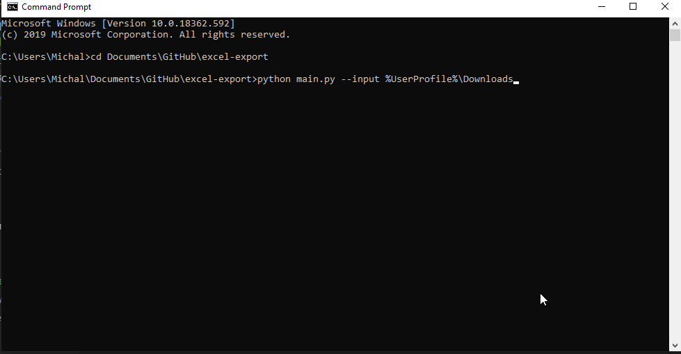

# Excel export
Prosty program do wyciągania danych z wielu plików Excela i zapisywania ich jako tabela w `docx`.



### Sciągnij paczkę z GH:

```bash
$ git clone https://github.com/mdyzma/excel-export.git

```

### Zainstaluj zależności

Przejdź do głównego folderu:

```bash
$ cd excel-export
```
Zainstaluj zależności:

```bash
pip install -r  requirements.txt
```


Aby móc wygenerować PDFa potrzebna jest też biblioteka `whtmltopdf`. Instrukcja instalacji:

https://github.com/JazzCore/python-pdfkit/wiki/Installing-wkhtmltopdf


Po instalacji należy dodać folder `bin` z folderu instalacji `whtmltopdf` do zmiennych środowiskowych.


### Uruchom

Przejdź do głównego folderu:

```bash
$ cd excel-export
```
Odpal program i podaj parametry

`--input <pliki-excela-na-dysku>`, `--filter <wartosc-ktora-filtrujemy>` oraz `--nsamples <liczba-wylosowanych-wynikow>`. Domyślna wartość dla liczby próbek wynosi `100`. Możliwe jest dodanie trzeciego parametru - folderu w którym zapisane będą wyniki `--destination <nazw-folderu-do-zapisania-wyników>`. Domyślna wartość to folder `~/exls_exports/`. Parametry oczywiście bez `<` i `>`

Przykład dla Windows:

```bash
python main.py --input %UerProfile%\Dokumenty\excel-files --nsamples 1000 --filter 5
```

Przykład dla Linux:

```bash
python main.py --input ~/excel-files --nsamples 1000 --filter 5
```

Jesli nie chcesz uzywać wszystkich plików, możesz skorzystać z opcji `--files` i podać scieżki konkretnych plików excela, np:

```bash
python main.py --files ~/path/to/excel/excel-file.xlsx --nsamples 1000 --filter 5
```

### Help

```bash
python main.py --help

usage: main.py [-h] [--input INPUT] [--destination DESTINATION]
               [--nsamples NSAMPLES]

optional arguments:
  -h, --help            show this help message and exit
  --input INPUT, -i INPUT
                        Ścieżka do folderu z plikami xls
  --destination DESTINATION, -d DESTINATION
                        Folder do zapiasania wynikow
  --nsamples NSAMPLES, -s NSAMPLES
                        Liczba wierszy wylosowana losowo z calego datasetu.
  --filter FILTER, -f FILTER
                        Liczba do filtrowania datasetu.
```
